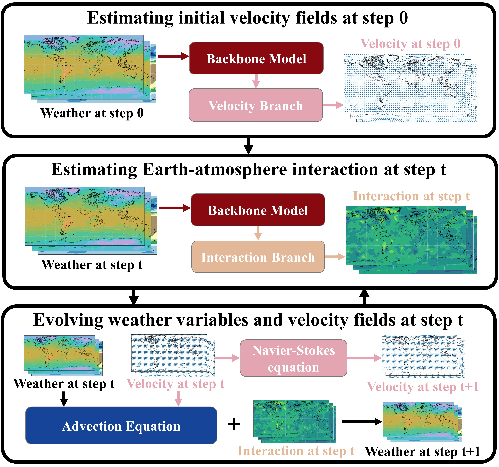
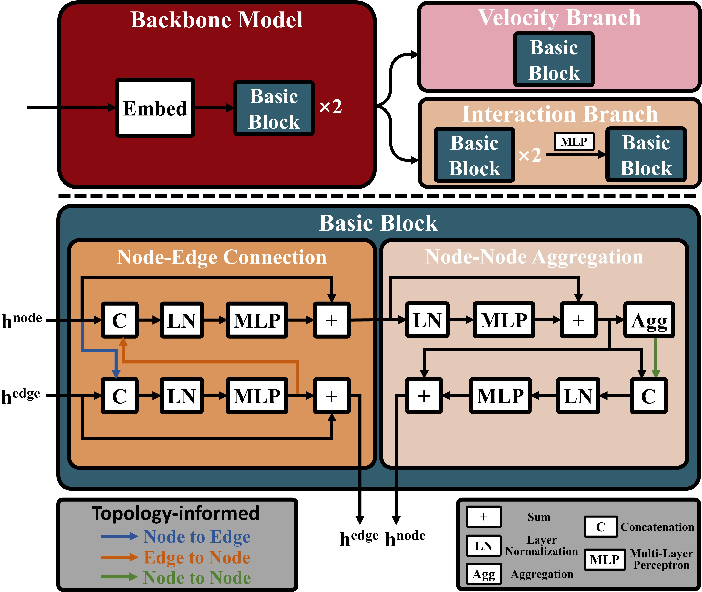

# PASSAT: Physics-assisted and topology-informed Weather Prediction
This repo is the official implementation of "Physics-Assisted and Topology-Informed Deep Learning for Weather Prediction".

## Updates
> ***04/28/2025*** 

* PASSAT has been accepted for IJCAI 2025. :tada: :tada: :tada: 

## Introduction
PASSAT is a novel deep learning model for weather prediction. PASSAT attributes the weather evolution to two key factors: (i) the advection process that can be characterized by the advection equation and the
Navier-Stokes equation; (ii) the Earth-atmosphere interaction that is difficult to both model and calculate. PASSAT also takes the topology of the Earth’s surface into consideration, other than simply treating it as a plane. With these considerations, PASSAT numerically solves the advection equation and the Navier-Stokes equation on the spherical manifold, utilizes a spherical graph neural network to capture the Earth-atmosphere interaction, and generates the initial velocity fields that are critical to solving the advection equation from the same spherical graph neural network.

 

## Citing PASSAT
Arxiv version is being uploaded

## Getting Started

Please see [get_started.md](get_started.md) for detailed instructions.
